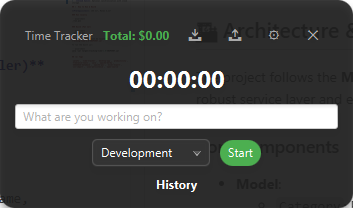

# Time Tracker

A lightweight desktop time tracking application built with **JavaFX** and **Apache Derby**. Designed for freelancers and professionals, it allows you to manage projects, calculate real-time earnings, and import/export detailed reports.



## 🏗 Architecture & Design

The project follows the **MVC (Model-View-Controller)** pattern with a robust service layer and embedded database persistence.

### Core Components

*   **Model**:
    *   `Category`: Represents a work category (name, color, hourly rate).
    *   `TimeEntry`: Records a work session (start/end time, description, historical rate).
    *   `TimeReport`: DTO for report generation and import/export.
*   **View**:
    *   FXML based UI (`widget.fxml`, `configuration.fxml`, `import_wizard.fxml`, `export_wizard.fxml`).
    *   Modern CSS styling.
*   **Controller**:
    *   `WidgetController`: Manages the main "always-on-top" widget and timer.
    *   `ConfigurationController`: Manages categories and settings.
    *   `ImportWizardController` & `ExportWizardController`: Handles data migration tasks.
*   **Service & Persistence**:
    *   `TimerService`: Core business logic.
    *   `DatabaseManager`: Manages connection to the embedded **Apache Derby** database.
    *   **DAOs**: `CategoryDAO`, `TimeEntryDAO`, `TimeReportDAO`.
    *   `TimeReportExportService` & `TimeReportImportService`: Handle JSON, CSV, XLSX, and Custom format data transfer.

### 💾 Data Persistence

*   **Database**: Data is securely stored in an embedded **Apache Derby** database located at `~/.tracking-time-db`.
*   **Migration**: Automatic migration from legacy JSON files if detected.
*   **Integrity**: Uses transactions and foreign keys to ensure data consistency.

### 📦 Packaging

*   Uses `maven-shade-plugin` to build a **"Fat Jar"**.
*   Includes a `Launcher` class to bypass JavaFX module restrictions.

## 🚀 Key Features

### Implemented ✅

*   **⏱️ Smart Timer**: Real-time tracking with activity descriptions and category selection.
*   **📜 History View**: Browse detailed history with date range filtering. Edit descriptions and categories inline, or delete entries with safety confirmation.
*   **📊 Category Management**: Create, edit, and manage categories with custom hourly rates and colors.
*   **📥 Import Wizard**: Import data from **JSON**, **CSV**, **Excel (XLSX)**, and **Custom** formats.
*   **📤 Export Wizard**: Export your history to **Excel**, **CSV**, or **JSON** with date range filtering.
*   **💰 Real-Time Earnings**: View daily earnings calculated instantly based on your rates.
*   **🎨 Modern UI**: Consistent dark mode styling across all windows (Configuration, Import, Export, History). featuring borderless, transparent windows with custom controls.
*   **💾 Robust Persistence**: Reliable SQL storage with automatic legacy data migration.
*   **🪟 Widget UI**: Draggable, transparent, and always-on-top window for unobtrusive tracking.

### Roadmap 🚧

*   **Charts**: Visual analytics of time usage (Weekly/Monthly breakdowns).
*   **Cloud Sync**: Optional synchronization with cloud storage.

## 🛠 How to Run & Build

**Prerequisites**: JDK 21+, Maven 3.11+

### Run locally

```powershell
.\run.ps1
```

### Build (Fat Jar)

```powershell
.\package.ps1
```

The executable jar will be located at `target/tracking-time-1.0-SNAPSHOT.jar`.

To run the built jar:

```powershell
java -jar target/tracking-time-1.0-SNAPSHOT.jar
```

## 🏷️ Tags


## 📄 License

This project is licensed under the **Apache License 2.0**. See the [LICENSE](LICENSE) file for details.

## 🤖 Acknowledgments

This project was developed with the assistance of **Google's AI Assistant**, which provided code generation, debugging support, and architectural guidance throughout the development process.
